# Doorbell Alexa (En Construcción)

¿Te ha pasado alguna vez que estas tan concentrado con tu trabajo con los cascos y no escuchas el timbre de la puerta? 
Este proyecto hara que Alexa te avise cada vez que alguien llame al timbre enviando una notificacion a tu dispositivo Echo.

# Hardware

### Necesario para darle vida

|   |   |   |   |
|---|---|---|---|
| Wemos D1 Mini |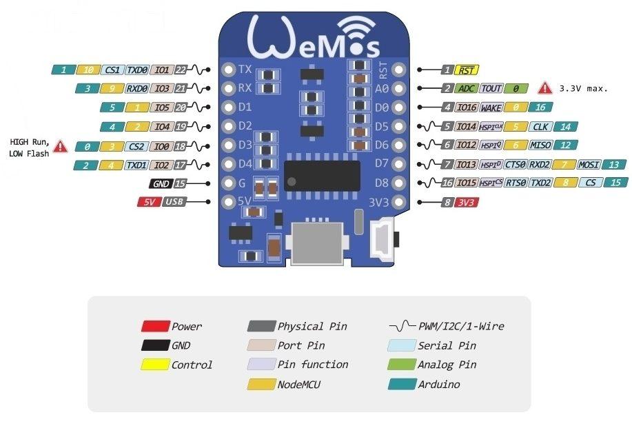|[](https://www.amazon.es/AZDelivery-D1-Mini-desarrollo-compatible/dp/B0754N794H)| Será el encargado de controlar el pulso del timbre y notificar a Alexa. |


### *Opcional
|   |   |   |   |
|---|---|---|---|
| Octoacoplador 4n33 |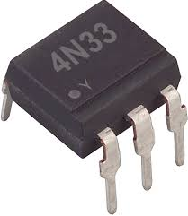|[](https://www.amazon.es/AZDelivery-D1-Mini-desarrollo-compatible/dp/B0754N794H)| Comunicacion entre circuitos aislados, sirve para proteger nuestro Wemos de una bajada/subida de tensión |
| 200 Ohm |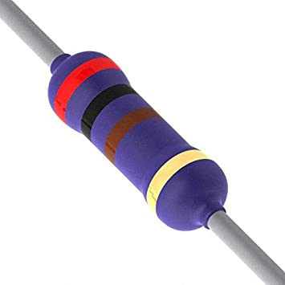|| Resistencia de 200 Ohm|
| 1K Ohm |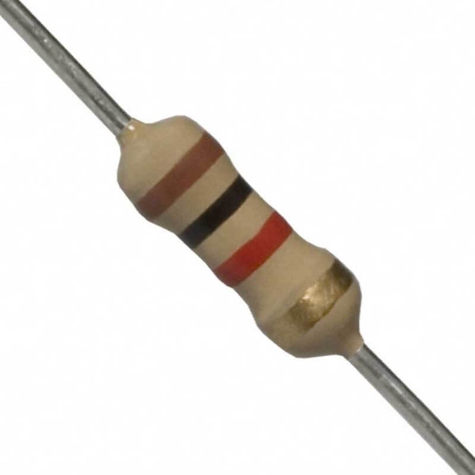|| Resistencia de 1K Ohm |

# Software
|   |   |   |
|---|---|---|
| Arduino IDE  | | <a href="https://www.arduino.cc/en/main/software">descarga</a> |
| Librería PubSubClient  | | <a href="https://github.com/knolleary/pubsubclient">descarga</a> |

# Herramientas

### Necesarias para realizar la operación

|   |   |   |
|---|---|---|
| PC + Arduino IDE  |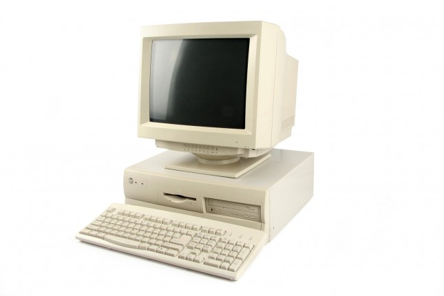 | Necesitaremos el IDE de Aduino:  <a href="https://www.arduino.cc/en/main/software">descarga</a> y un Pc al que conectarlo. |
| estaño para soldar |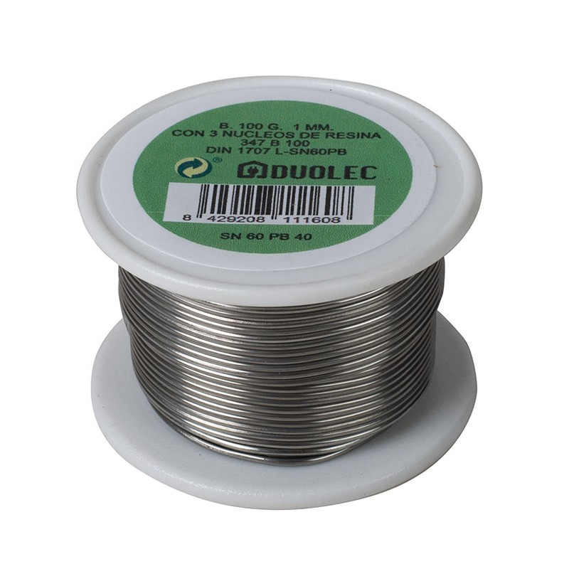 | Lo usaremos para soldar los componentes.  |
| soldador de estaño |  | Vale cualquier soldador, aunque recomiendo la marca JBC.  |
| cable mini-usb  |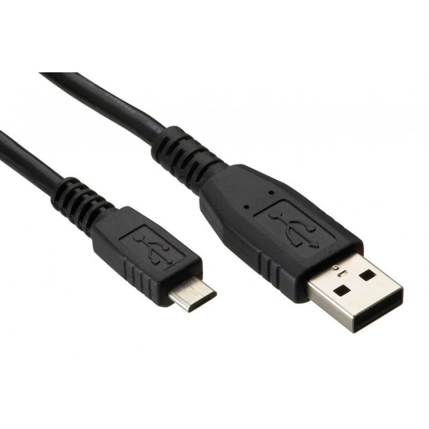|Necesario para poder flashear el código al Wemos D1 Mini.|
| clema x4  |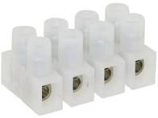| Necesaria para conectar el circuito al timbre/corriente. |

# Preparación

Pasos previos antes de construir el dispositivo

|   |   |   |
|---|---|---|
|  0 |   | Recomiendo ver el video tutorial del que me base donde viene todo el proceso explicado: https://www.youtube.com/watch?v=cgfVXPfCgkc  |
|  1 |   | Nos registramos en <a href="https://www.smartnest.cz/index/ES">Smartnest</a> y creamos un dispositivo Timbre  |
|  2 |   | Desde la configuracion de Alexa (App movil o web) vinculamos nuestra cuenta Smartnest y elegimos el dispositivo que notificará |
|  3 |   | Con las credenciales generadas de Smartnest, y nuestra configuración de Wifi, modificamos en el codigo la siguiente sección:|

``` #define SSID_NAME "Wifi-name"               // Your Wifi Network name
#define SSID_PASSWORD "Wifi-password"           // Your Wifi network password
#define MQTT_BROKER "smartnest.cz"              // Broker host
#define MQTT_PORT 1883                          // Broker port
#define MQTT_USERNAME "username"                // Username from Smartnest
#define MQTT_PASSWORD "password"                // Password from Smartnest (or API key)
#define MQTT_CLIENT "device-Id"                 // Device Id from smartnest 
``` 

# Proceso

El proceso que yo segui es el siguiente
|   |   |   |
|---|---|---|
|  1 |   | Instalar la libreria PubSubClient en el IDE - <a href="https://github.com/knolleary/pubsubclient">ver codigo</a> .  |
|  2 |   | Flashear el codigo en el arduino nano - <a href="https://github.com/danijerez/doorbell_alexa/blob/master/doorbell/doorbell.ino">ver codigo</a> .  |
|  3  | (opcional) |Seguimos el siguiente esquema para preparar el circuito que protegerá al Wemos D1 |

 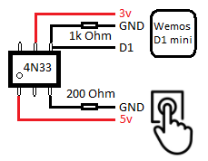 

* Si tu timbre tiene una salida de 230V tendras que poner un transformador (230v - 5v). Recuerda que el wemos D1 mini tambien tiene que estar alimentado por 5v en el pin 5v.
Yo utilice dos cagadores de moviles antiguos para solventar esto.


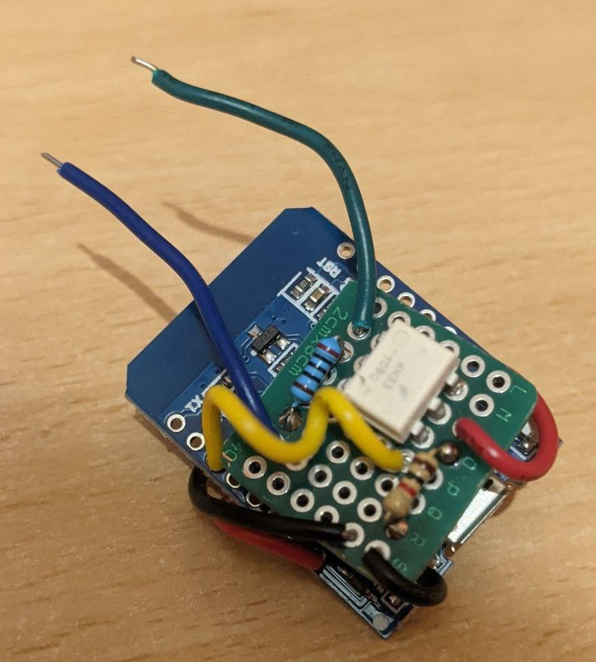 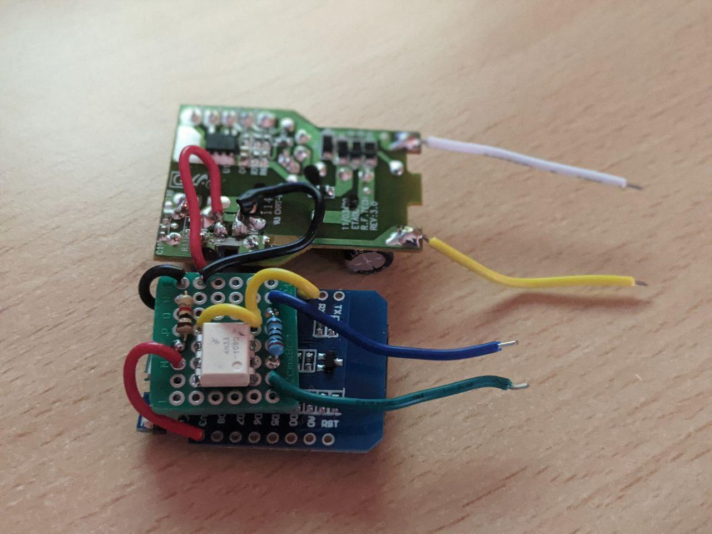 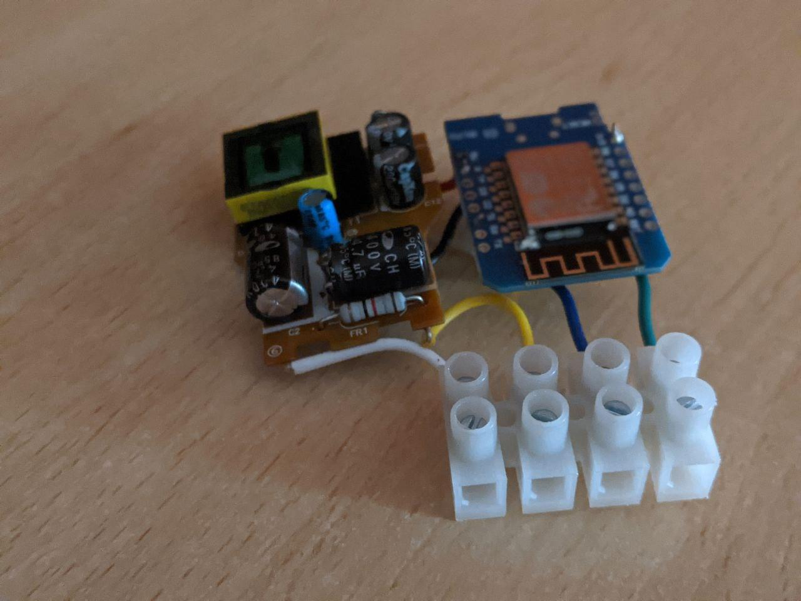  

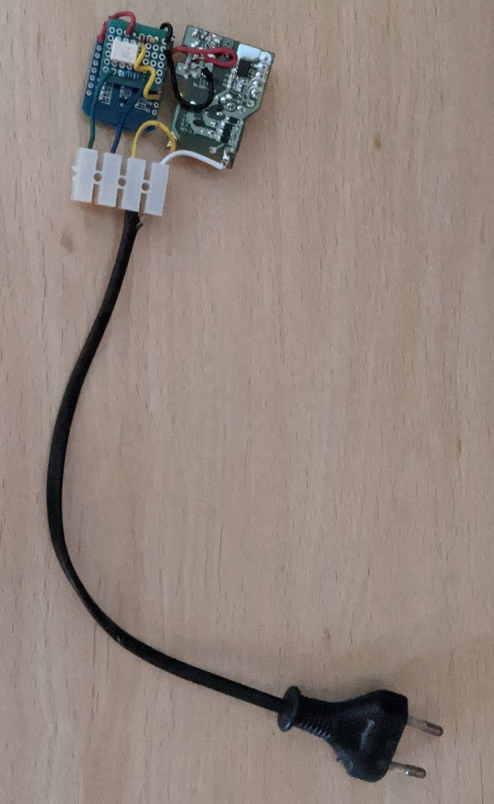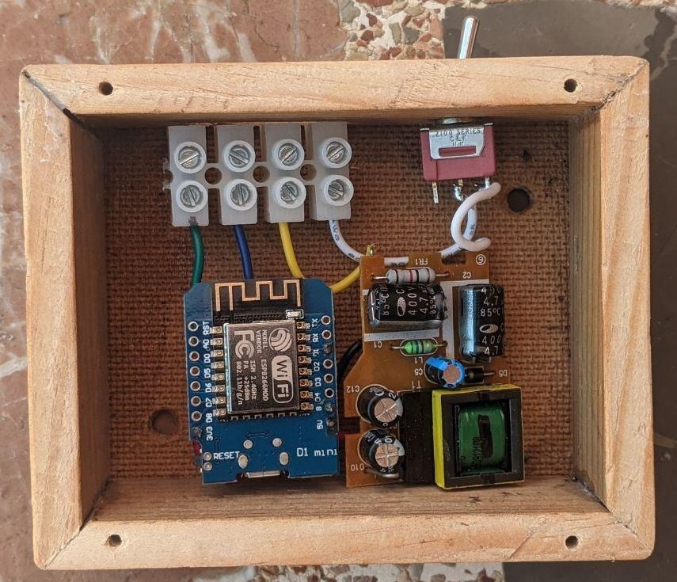   

* Este seria el resultado añadiendo un transformador mas

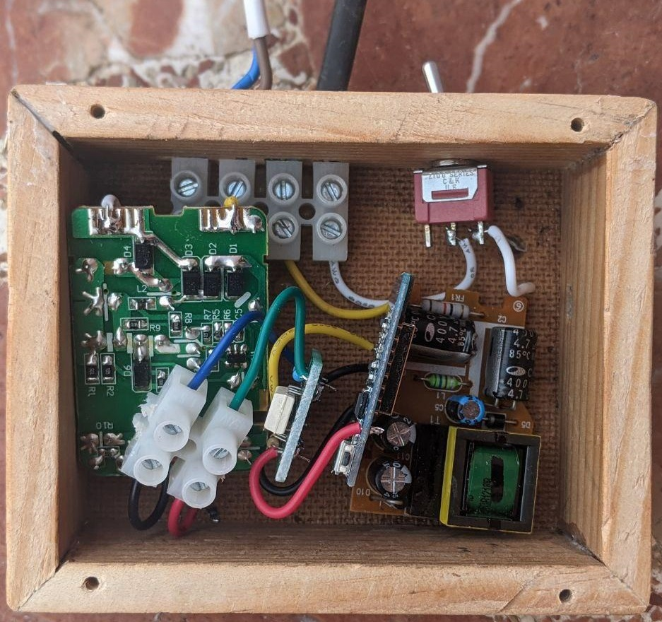   

* Puedes meter todo el conjunto en una caja si no quieres que se vea.

# Pruebas

Dejo algunos videos de prueba mientras hice el proyecto, espero que os guste!

|   |   |   |
|---|---|---|
|[](https://youtu.be/0RNIjLOwQlc "test - alexa doorbell")|||


# Documentación

* https://www.youtube.com/watch?v=cgfVXPfCgkc
* https://www.smartnest.cz
* https://github.com/knolleary/pubsubclient
