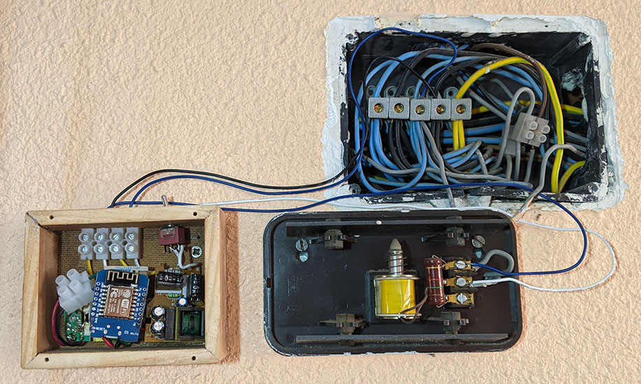
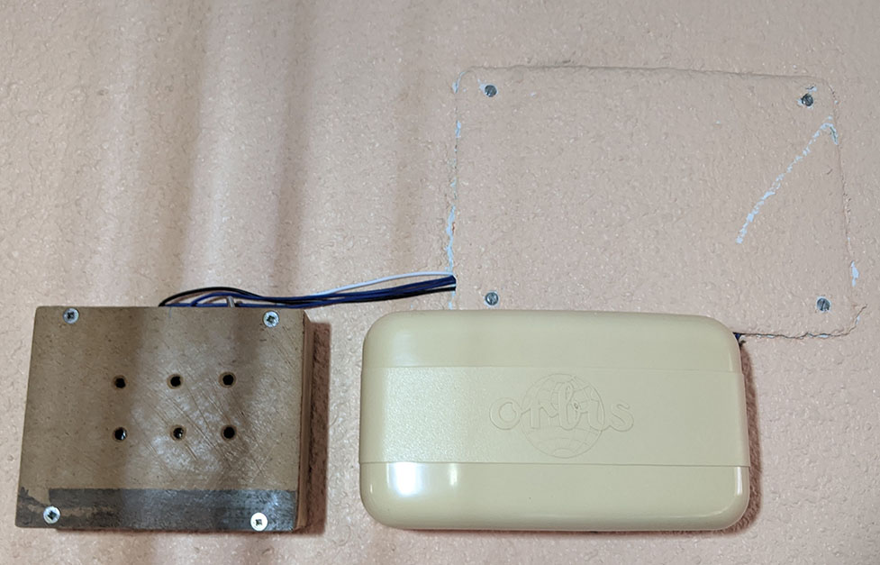

# 🛎️ Doorbell Alexa

### 🥸 ¿Te ha pasado alguna vez que estas tan concentrado con tu trabajo con los cascos y no escuchas el timbre de la puerta? 

### ⏰ Este proyecto hará que Alexa te avise cada vez que alguien llame al timbre, enviando una notificacion a tu dispositivo Echo.

# 🖖 [](https://twitter.com/d4nijerez) 

## 🧩 Componentes
Wemos D1 Mini
<a href="https://www.amazon.es/AZDelivery-D1-Mini-desarrollo-compatible/dp/B0754N794H">
    
</a>

### ✨ Opcional
<table style="width:100%">
    <tr>
    <td>
    Octoacoplador 4n33
	<a href="https://www.amazon.es/gp/product/B07MY3NZ18/ref=ppx_yo_dt_b_asin_image_o00_s00?ie=UTF8&psc=1">
  		
	</a>
	</td>
        <td>
    200 Ohm
	<a>
  		
	</a>
	</td>
        <td>
    1K Ohm
	<a>
  		
	</a>
	</td>
</table>

## 💿 Programas
[](https://www.arduino.cc/en/software)
[](https://github.com/knolleary/pubsubclient)

## 💾 Código
[](https://github.com/danijerez/doorbell_alexa/tree/master/doorbell)

## 🎨 Preparación

|#|   |   |
|---|---|---|
|  0 |   | Recomiendo ver el video tutorial del que me base donde viene todo el proceso explicado: https://www.youtube.com/watch?v=cgfVXPfCgkc  |
|  1 |   | Nos registramos en <a href="https://www.smartnest.cz/index/ES">Smartnest</a> y creamos un dispositivo Timbre  |
|  2 |   | Desde la configuracion de Alexa (App movil o web) vinculamos nuestra cuenta Smartnest y elegimos el dispositivo que notificará |
|  3 |   | Con las credenciales generadas de Smartnest, y nuestra configuración de Wifi, modificamos en el codigo la siguiente sección:|

``` #define SSID_NAME "Wifi-name"               // Your Wifi Network name
#define SSID_PASSWORD "Wifi-password"           // Your Wifi network password
#define MQTT_BROKER "smartnest.cz"              // Broker host
#define MQTT_PORT 1883                          // Broker port
#define MQTT_USERNAME "username"                // Username from Smartnest
#define MQTT_PASSWORD "password"                // Password from Smartnest (or API key)
#define MQTT_CLIENT "device-Id"                 // Device Id from smartnest 
``` 

## 🧰 Tutorial

|#|   |   |
|---|---|---|
|  1 |   | Instalar la libreria PubSubClient en el IDE - <a href="https://github.com/knolleary/pubsubclient">ver codigo</a> .  |
|  2 |   | Flashear el codigo en el arduino nano - <a href="https://github.com/danijerez/doorbell_alexa/blob/master/doorbell/doorbell.ino">ver codigo</a> .  |
|  3   || (opcional) Seguimos el siguiente esquema para preparar el circuito que protegerá al Wemos |
|  4   || * Si tu timbre tiene una salida de 230V tendras que poner un transformador (230v - 5v). Recuerda que el wemos D1 mini tambien tiene que estar alimentado por 5v en el pin 5v. Yo utilice dos cagadores de moviles antiguos para solventar esto. Te recomiendo que hagas algunas pruebas antes de instalar todo, como muestro en los videos. |
|  4   || * Este seria el resultado añadiendo un transformador mas   |
|  5   || * Puedes meter todo el conjunto en una caja si no quieres que se vea.   |
|  6   || * La instalación se puede hacer al lado del timbre/telefonillo   |


 


## 🧪 Testing
[](https://youtu.be/eLEP1y79GZg)
[](https://youtu.be/eLEP1y79GZg)

## 💡 Documentación

* https://www.youtube.com/watch?v=cgfVXPfCgkc
* https://www.smartnest.cz
* https://github.com/knolleary/pubsubclient
